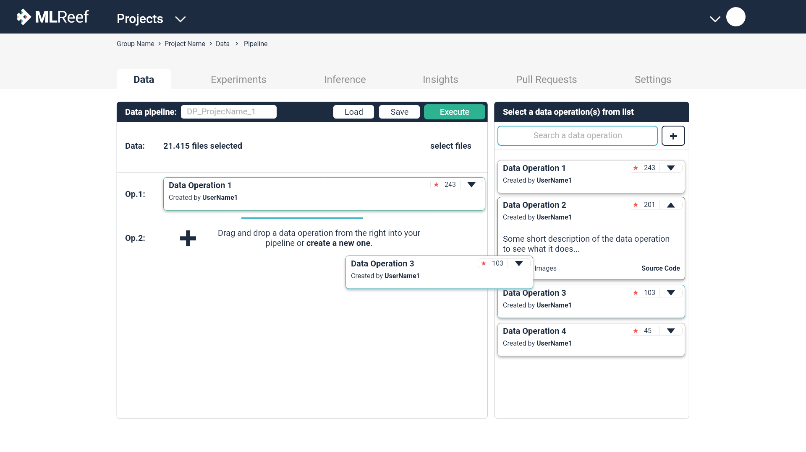
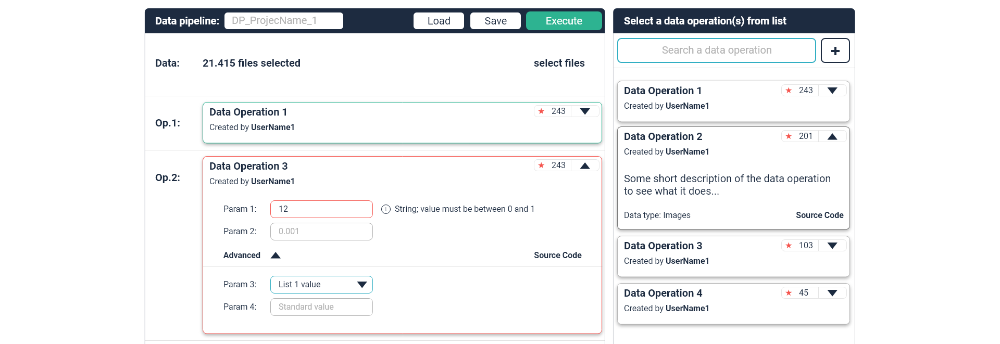

Data processing
====================

The data processing (or preprocessing) pipeline is the workflow to change your data in automated tasks defined by data processing operations. 

You will find the key resources here to use data pipelines and operations here. 

How to create a new data processing pipeline
--------------------

You can access the data processing pipeline through your ML project repository within the `data` tab by pressing the `Data Pipeline` button: 

## Creating a new pipeline

Now you are viewing the default data pipeline. Start by selecting the data files you want to pre-process by pressing the `select data` button, which will open a modal view of your repository: 

> Tip: You can select data from different branches. Use this for creating fast iterations or building more complex processing chains. 

Accpet the files or folders you want to preprocess. Now you can create a data processing pipeline by searching and `drag´n drop` data processing operations from the list on the right to your pipeline: 

> Note, that in a data processin pipeline the selected data operations are executed one after the other in an upcounting order. Each selected file will therefore be processed first by the first data operations.

## Changing parameters

The data operations listed are community generated and based on python scripts. They operate on one basic rule: 

**data in -> operation -> data out**

By expanding a selected operation in your pipeline, you will gain access to available [parameters](parameters.md) set by the creator of the operation.

There are two classes of parameters: 

* **Standard**: These are empty, need user input and are required.
* **Advanced**: These have standard values, don´t need a specific user input and are optional.

> Note: MLReef includes parameter testing after executing a pipeline.

## Executing a data processing pipeline

When you created your data processing pipeline, press the `execute` button and navigate through the modal. 

The output files of a data processing pipeline are stored in a [data instance](../data_instance.md). 

